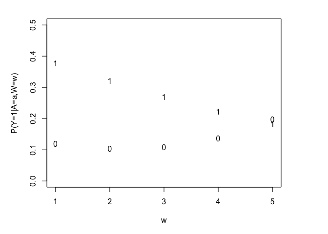
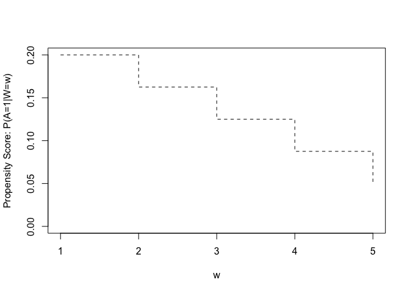
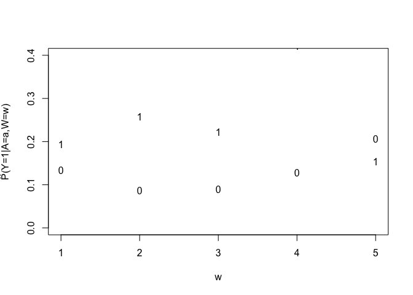
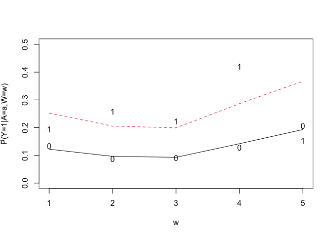

APPENDIX B
============

Introduction
============

In Appendix B, we use a more complicated simulation to illustrate the application of semi-parametric estimation methodologies. Similar to the main simulation in the chapter, and in Appendix A, we use a simple example with an exposure A, an outcome Y, and one confounding variable W. Following the example from the chapter, we can think of A as physical abuse, Y and psychopathology in adulthood, and W as childhood socioeconomic status.

Data Generating Model
=====================

The simulation is based on the following model *W* is uniform across integers 1-5, *P*(*A* = 1 ∣ *W*)=0.1200, 0.1025, 0.0850, 0.0675, 0.0500 for *W* = 1, 2, 3, 4, 5 respecitively. The model for *Y* is binomial, based on the logistic regression model:
*l**o**g**i**t*(*P*(*Y* ∣ *A* = *a*, *W* = *w*)) = *b*<sub>0</sub> + *b*<sub>1</sub>*a* + *b*<sub>2</sub> \* (*w* − 1)+*b*<sub>3</sub> \* (*w* − 1)<sup>2</sup> + *b*<sub>4</sub> \* *a* \* (*w* − 1)<sup>2</sup>
 with *b*<sub>0</sub>, *b*<sub>1</sub>, *b*<sub>2</sub>, *b*<sub>3</sub>, *b*<sub>4</sub> = ( − 2, 1, −0.25, 0.05, −0.05).

``` r
### Data Generating Function
dat.gen.2 = function(n, probsw, probsa, bY) {
    W = sample(1:5, n, replace = T, prob = probsw)
    A = rbinom(n, 1, probsa[W])
    X = cbind(1, A, W - 1, (W - 1)^2, A * (W - 1)^2)
    PYgivenAW = 1/(1 + exp(-(X %*% bY)))
    Y = rbinom(n, 1, PYgivenAW)
    return(data.frame(W, A, Y))
}

### Definies parameters of data-generating distribution probsw= P(W=w)
probsw = c(0.2, 0.2, 0.2, 0.2, 0.2)
#### parameters to define P(A=1 | W)
probsa = c(seq(0.2, 0.05, length = 5))
#### parameters to define P(Y |A, W)
bY = c(-2, 1.5, -0.25, 0.1, -0.1)
### Sample Size
n = 1000
### Random number seed so can replicate results
set.seed(4041)
### Use function with set paramters to generate random sample of data
dat = dat.gen.2(n, probsw, probsa, bY)
### Get the true values of the relevant distributional parameters and plot the
### true distribuiton
par(mfrow = c(1, 1))
par(mar = c(5, 5, 2, 5))
### w at the possible values
w = 1:5
### design matrix for model for Y given A=0, given W and P(Y|A=0,W)
Xt = cbind(1, 0, w - 1, (w - 1)^2, 0)
PYgivena0w = 1/(1 + exp(-(Xt %*% bY)))
### design matrix for model for Y given A=1, given W and P(Y|A=1,W)
Xt = cbind(1, 1, w - 1, (w - 1)^2, (w - 1)^2)
PYgivena1w = 1/(1 + exp(-(Xt %*% bY)))
### Plot True distribution of Y given A=a,W=w
plot(w, PYgivena1w, pch = "1", ylim = c(0, 0.5), xlab = "w", ylab = "P(Y=1|A=a,W=w)")
points(w, PYgivena0w, pch = "0")
```


**Figure 1:** True model of P(Y=1 | A=a,W=w)


Figure 1 depicts the probabilities of the outcome *Y* for the exposed (the 1s) and the unexposed (the 0s), by categories of the *W*, or *P*(*Y* ∣ *A*, *W*). The association of *A* with *Y* is stronger for lower values of *W*, as evidenced by the larger difference between the 1 and 0 data points on the plot. Using the example from the chapter, this depicts a situation in which physical abuse (*A*) has a stronger association with pychopathology in adulthood (*Y*) among those with lower childhood SES (*W*)

``` r
## Make plot of P(A=1|W)
PAgivenW = probsa
plot(w, PAgivenW, type = "s", lty = 2, xlab = "w", ylab = "Propensity Score: P(A=1|W=w)", 
    ylim = c(0, 0.2))
```



**Figure 2:** The true treatment mechanism


Figure 2 depicts the probabilities of the exposure *A* by categories of the *W*. The probability of of exposure A, also known as the propensity score, is higher for lower values of W. Using the example from the chapter, this depicts a situation in which there is a higher probability of physical abuse (A) among those with lower childhood SES (W).

After generating and examining the simulated data, we now calculate the true values of the parameters of interest from the simulated data.

``` r
### organize the true distribution of Y given A=a,W=w into a a single data
### frame for use below
yprobdat = data.frame(PYgivena0w, PYgivena1w)
yprobdat = data.frame(W = 1:5, pw = probsw, yprobdat)
yprobdat = data.frame(yprobdat, probsa)
## Get estimates of the parameters that makeup the the relevant parts of the
## distribution
rm(Y, A, W)
### est of P(Y|A=a,W=w)
attach(dat)
yprobobs = NULL
for (i in 1:5) {
    pyaw = mean(Y[A == 1 & W == i])
    pyaw = c(pyaw, mean(Y[A == 0 & W == i]))
    yprobobs = rbind(yprobobs, pyaw)
}
detach(2)
### est of P(W=w)
attach(dat)
tt = table(A, Y, W)
wtab = (table(W)/(length(W)))
detach(2)
### Organize est elements of distribution into one data frame
tabout = NULL
for (i in 1:5) {
    tabout = rbind(tabout, c(wtab[i], tt[2, 2, i], sum(tt[2, , i]), yprobobs[i, 
        1], tt[1, 2, i], sum(tt[1, , i]), yprobobs[i, 2]))
}
colnames(tabout) = paste("est.", c("pw", "ny1", "na1", "pya1w", "ny0", "na0", 
    "pya0w"), sep = "")

res.out = cbind(yprobdat[, c(1:2, 4, 3)], diff.tr = yprobdat[, 4] - yprobdat[, 
    3], tabout, diff.est = tabout[, "est.pya1w"] - tabout[, "est.pya0w"])

### Estimates of CRD and other causal parameters using saturated
### (nonparametric) estimating model
crd.sat = sum(tabout[, 1] * (tabout[, 4] - tabout[, 7]))
#### est E(Y0)
ey0.sat = sum(tabout[, 1] * tabout[, 7])
#### est E(Y1)
ey1.sat = sum(tabout[, 1] * tabout[, 4])
### True CRD
crd.true = sum(yprobdat[, 2] * (yprobdat[, 4] - yprobdat[, 3]))
#### true E(Y0)
ey0.true = sum(yprobdat[, 2] * (yprobdat[, 3]))
#### true E(Y1)
ey1.true = sum(yprobdat[, 2] * (yprobdat[, 4]))
#### True EY
ey.true = sum(yprobdat[, 2] * yprobdat[, 4] * yprobdat[, 5] + (yprobdat[, 2] * 
    yprobdat[, 3] * (1 - yprobdat[, 5])))
### true CPAR
cpar.true = ey.true - ey0.true
### est CPAR from saturated model
cpar.sat = mean(dat[, "Y"]) - ey0.sat
## Figure for observed data
w = 1:5
a = c(0, 1)
par(mfrow = c(1, 1))
# par(mar = c(5,5,2,5))
plot(w, yprobobs[, 1], pch = "1", ylim = c(0, 0.4), xlab = "w", ylab = expression(paste(hat(P), 
    "(Y=1|A=a,W=w)", sep = "")))
points(w, yprobobs[, 2], pch = "0")
```



**Figure 3:** Estimated P(Y=1|A=a,W=w) based on saturated model.

This results in the following true value of the causal risk difference (CRD) :

``` r
## Accumulate results so far into a data.frame and table
dt.out = data.frame(ey0.true, ey1.true, ey.true, crd.true, cpar.true)
```

We examine the results in Table 1.

``` r
library(knitr)
knitr::kable(dt.out, format = "markdown",caption="Screw you")
```
**Table 1:** True Parameter Values.

|  ey0.true|   ey1.true|    ey.true|   crd.true|  cpar.true|
|---------:|----------:|----------:|----------:|----------:|
|  0.133264|  0.2744858|  0.1559951|  0.1412218|  0.0227311|

Estimators
==========

In next subsections, we explore estimation using different methods with different assumptions from nonparametric model (no assumptions) to assuming smoother (more parametric) models.

Nonparametric Model
-------------------

For this, we simply get the proportion of *Y* = 1 among the 10 unique groups defined by both *A* and *W*. The substitution estimator in general is:
\begin{foo}
\hat{crd}=\frac{1}{n} \sum\_{i=1}^n \hat{Y}(1,W_i)-\hat{Y}(0,W_i)
\end{foo}

 where $\\hat{Y}(a,W)$ is simply the predicted value (whatever the procedure used) of *Y* when *A* is set to *a* for a subject, but one uses their observed *W*. To esitmate the populaiton attributable risk (or *E*(*Y*(0)−*Y*),the resulting estimator is very similar:
$$
\\widehat{cpar}=\\frac{1}{n} \\sum\_{i=1}^n \\hat{Y}(A\_i,W\_i)-\\hat{Y}(0,W\_i),
$$
 where $\\hat{Y}(A\_i,W\_i)$ is the predicted value for both the observed value of the confounders, *W*<sub>*i*</sub> and the observed treatment *A*<sub>*i*</sub>.

When we use the nonparametric (or \`\`saturated'') model here, it's the equivalent of fitting a logistic regression model of form
$$
logit(P(Y \\mid A=a, W=w))=b\_0+b\_1 a+\\sum\_{j=2}^5 b\_j\*I(w=j)+c\_j\*a\*I(w=j)
$$
 which simply has all the appropriate dummy variables for the categories the interactions of those with the variable of interest. Given this model assumes nothing about the relationship of *Y* to (*A*, *W*), we know our resulting estimate will have no bias, but might be unnecessarily variable. When we fit such a model, we get the following results. See also Figure .

``` r
#################### Estimated EY(0)
print(ey0.sat)
```

    ## [1] 0.1305999

``` r
## EY(1)
print(ey1.sat)
```

    ## [1] 0.2508041

``` r
## EY
print(mean(dat[, "Y"]))
```

    ## [1] 0.145

``` r
## crd
print(crd.sat)
```

    ## [1] 0.1202042

``` r
## crd
print(cpar.sat)
```

    ## [1] 0.01440006

Simpler Logistic Regression Model
---------------------------------

The most common way that researchers estimate the effect of *A* on *Y*, is to assume a parametric model, adjusting for *W*. Here we fit a main terms logistic regression, as was done in the analysis in the chapter. Specifically, we fit a simpler model similar to above but without the interaction terms:
$$
logit(P(Y \\mid A=a, W=w))=b\_0+b\_1 a+\\sum\_{j=2}^5 b\_j\*I(w=j)
$$

``` r
## Fit linear-logistic model (not saturated) for Y|A,W
glm1 = glm(Y ~ A + factor(W), data = dat, family = binomial())
## Function to convert results of glm into interpretable parameters, such as
## odds ratios and provide inference
lreg.or <- function(glm.mod, robust = FALSE, mult = NULL) {
    # robust indicates sandwich estimator mult is the OR for the 'mult' change
    # in the corresponding predictors
    if (robust == TRUE) {
        glm.1 <- robcov(glm.mod)
        se = sqrt(diag(glm.1$var))
        cf = glm.1$coefficients
        lreg.coeffs = cbind(cf, se)
    }
    if (robust == FALSE) {
        lreg.coeffs <- coef(summary(glm.mod))
    }
    p = dim(lreg.coeffs)[1]
    if (is.null(mult)) {
        mult = rep(1, p - 1)
    }
    l95ci <- exp(mult * (lreg.coeffs[2:p, 1] - 1.96 * lreg.coeffs[2:p, 2]))
    or <- exp(mult * lreg.coeffs[2:p, 1])
    u95ci <- exp(mult * (lreg.coeffs[2:p, 1] + 1.96 * lreg.coeffs[2:p, 2]))
    pvalue = (2 * (1 - pnorm(abs(lreg.coeffs[, 1]/lreg.coeffs[, 2]))))[2:p]
    
    lreg.or <- cbind(l95ci, or, u95ci, pvalue)
    lreg.or
}
```

When we fit this, we get the following logistic regression results.

``` r
## Show results of glm fit
summary(glm1)
```

    ## 
    ## Call:
    ## glm(formula = Y ~ A + factor(W), family = binomial(), data = dat)
    ## 
    ## Deviance Residuals: 
    ##     Min       1Q   Median       3Q      Max  
    ## -0.9567  -0.5535  -0.5107  -0.4418   2.1795  
    ## 
    ## Coefficients:
    ##             Estimate Std. Error z value Pr(>|z|)    
    ## (Intercept)  -1.9713     0.2148  -9.176  < 2e-16 ***
    ## A             0.8861     0.2450   3.617 0.000298 ***
    ## factor(W)2   -0.2673     0.3001  -0.891 0.373180    
    ## factor(W)3   -0.3063     0.3247  -0.943 0.345542    
    ## factor(W)4    0.1726     0.2839   0.608 0.543111    
    ## factor(W)5    0.5410     0.2711   1.996 0.045972 *  
    ## ---
    ## Signif. codes:  0 '***' 0.001 '**' 0.01 '*' 0.05 '.' 0.1 ' ' 1
    ## 
    ## (Dispersion parameter for binomial family taken to be 1)
    ## 
    ##     Null deviance: 827.87  on 999  degrees of freedom
    ## Residual deviance: 805.95  on 994  degrees of freedom
    ## AIC: 817.95
    ## 
    ## Number of Fisher Scoring iterations: 4

``` r
lreg.or(glm1)
```

    ##                l95ci        or    u95ci       pvalue
    ## A          1.5007134 2.4256369 3.920612 0.0002979676
    ## factor(W)2 0.4250482 0.7654569 1.378489 0.3731804955
    ## factor(W)3 0.3895747 0.7361784 1.391155 0.3455417969
    ## factor(W)4 0.6812995 1.1884178 2.073004 0.5431111274
    ## factor(W)5 1.0097122 1.7177753 2.922369 0.0459718303

We can also look at a plot of the model (see figure ).

``` r
## Plot the estimated parts of distribution from both simpler logistic model
## and saturated model.
par(mfrow = c(1, 1))
plot(w, yprobobs[, 1], pch = "1", ylim = c(0, 0.5), xlab = "w", ylab = expression(paste(hat(P), 
    "(Y=1|A=a,W=w)", sep = "")))
points(w, yprobobs[, 2], pch = "0")
datn = data.frame(W = 1:5, A = 0)
predA0 = predict(glm1, newdata = datn, type = "response")
lines(w, predA0, lty = 1, col = 1)
datn = data.frame(W = 1:5, A = 1)
predA1 = predict(glm1, newdata = datn, type = "response")
lines(w, predA1, lty = 2, col = 2)
```



``` r
## Update results data.frame with glm results
res.out = cbind(res.out, glm.predA1 = predA1, glm.predA0 = predA0, glm.diff = predA1 - 
    predA0)
```

Now, using this model result to derive $\\hat{Y}(a,W)$ for our crd estimator, we get:

``` r
## Use model to predict Y at A=0,W and A=1,W.
datn = dat
predA = predict(glm1, newdata = datn, type = "response")
### Est E(Y)
eyA.glm = mean(predA)
### Est E(Y0)
datn[, "A"] = 0
predA0 = predict(glm1, newdata = datn, type = "response")
eyA0.glm = mean(predA0)
### Est E(Y1)
datn[, "A"] = 1
predA1 = predict(glm1, newdata = datn, type = "response")
eyA1.glm = mean(predA1)
### Est CRD
crd.glm = eyA1.glm - eyA0.glm
### Est CPAR
cpar.glm = eyA.glm - eyA0.glm
# EY(0)
print(eyA0.glm)
```

    ## [1] 0.1306585

``` r
# EY(1)
print(eyA1.glm)
```

    ## [1] 0.2644214

``` r
# EY
print(eyA.glm)
```

    ## [1] 0.145

``` r
# crd
print(crd.glm)
```

    ## [1] 0.1337629

``` r
# cpar
print(cpar.glm)
```

    ## [1] 0.01434152

Semiparametric Machine Learning (SuperLearner)
----------------------------------------------

To demonstrate an alternative approach which is based upon flexible, data adaptive methods, we also fit the the regression model using the so-called SuperLearner. SuperLearner allows the user to enter a library of potential model selection routines, such as stepwise procedures, polynomial splines, and classification and regression-trees , and uses cross-validation to select the best routine or weighted combination of routines without overfitting. Our implementation is based on using 2 simple learners: simple logistic regression with only main terms for both *A* and unordered categorical *W*. We also implement stepwise logistic regression, allowing for main terms and 2-way interactions (e.g., *I*(*W* = *w*)\**A*). See Figure for results.

``` r
## Examples of wrappers of learners to add to SL
SL.inter2 = function(Y, X, newX, family, direction = "both", trace = 0, k = 2, 
    ...) {
    fit.glm <- glm(Y ~ ., data = X, family = family)
    fit.step <- step(fit.glm, scope = list(lower = Y ~ A, upper = Y ~ .^2), 
        direction = direction, trace = trace, k = k)
    pred <- predict(fit.step, newdata = newX, type = "response")
    fit <- list(object = fit.step)
    out <- list(pred = pred, fit = fit)
    class(out$fit) <- c("SL.step")
    return(out)
}
## Library of learners for SL
SL.library = list("SL.glm", "SL.inter2")
## Make basis functions for use in SL
attach(dat)
newdat = model.matrix(~factor(W - 1))
detach(2)
newdat = data.frame(dat, newdat)
newdat = newdat[, -c(1, 4)]
names(newdat)[3:6] = paste("W", 2:5, sep = "")
newX = newdat[, -2]
YY = newdat[, 2]
## Fit SL
SLfit = SuperLearner(Y = YY, X = newX, family = binomial(), SL.library = SL.library)
## Get prediction of Y at A=0,W
newX2 = newX
newX2[, "A"] = 0
p0 = predict(SLfit, newX2)$pred
## Get prediction of Y at A=1,W
newX2[, "A"] = 1
p1 = predict(SLfit, newX2)$pred
## Update results data frame
res.out = cbind(res.out, SL.predA = p1, SL.predA0 = p0, SL.diff = p1 - p0)
## Est E(Y1),E(Y0), CRD, EY, CPAR, respectively
ey1.SL = mean(p1)
ey0.SL = mean(p0)
crd.SL = mean(p1 - p0)
ey.SL = mean(SLfit$SL.predict[1:10])
cpar.SL = ey.SL - mean(p0)
## Plot the SL fit to data
par(mfrow = c(1, 1))
w = 1:5
plot(w, yprobobs[, 1], pch = "1", ylim = c(0, 0.5), xlab = "w", ylab = expression(paste(hat(P), 
    "(Y=1|A=a,W=w)", sep = "")))
points(w, yprobobs[, 2], pch = "0")
plotdat = model.matrix(~factor(w - 1))
plotdat = plotdat[, -1]
plotdat = data.frame(A = 0, plotdat)
names(plotdat)[2:5] = paste("W", 2:5, sep = "")
p0 = predict(SLfit, plotdat)$pred
lines(w, p0, lty = 1, col = 1)
plotdat[, 1] = 1
p1 = predict(SLfit, plotdat)$pred
lines(w, p1, lty = 2, col = 2)
```


``` r
## Udate results
res.out = cbind(res.out, SL.predA1 = p1, SL.predA0 = p0, SL.diff = p1 - p0)
```

\subsection{TMLE}
Using SuperLearner to fit the outcome model has the potential to do better than the simple parametric model. However, the model fit will not be optimal for the parameter of interest, and there is no theory based way to get statistical inference (confidence intervals). Targeted Maximum Likelihood Estimation (TMLE) works by modifying the initial estimator based on data-adaptive fitting of the outcome model, such that the resulting model provides a more targeted bias/variance trade-off for the parameter of interest. TMLE uses a simple augmentation of the original fit of *E*(*Y*|*A*, *W*), by adding a “clever covariate” that is related to the propensity score, also known as the treatment mechanism *P*(*A* = 1|*W*). Informally, one can think of this covariate as capturing residual confounding specific to the parameter of interest.Finally, we used TMLE, using the SL fit discussed above as the initial fit, and using simple logistic regression to derive the propensity score used in the clever covariate.

``` r
## wrapper for simple (mispecified) glm learner
SL.glm.simp = function(Y, X, newX, family, obsWeights, ...) {
    fit.glm <- glm(Y ~ W, data = X, family = family, weights = obsWeights)
    pred <- predict(fit.glm, newdata = newX, type = "response")
    fit <- list(object = fit.glm)
    class(fit) <- "SL.glm"
    out <- list(pred = pred, fit = fit)
    return(out)
}
## specifiy library for estimate P(A=1|W)
gl.lib = list("SL.glm.simp")
## Make data structure expected for input into TMLE
YY = dat[, "Y"]
AA = newX[, 1]
WW = data.frame(newX[, 2:5], W = dat[, "W"])
## Run TMLE
tmle.rest = tmle(YY, AA, WW, Q.SL.library = "SL.inter2", family = "binomial", 
    verbose = TRUE, gform = A ~ W)
```

    ##  Estimating initial regression of Y on A and W
    ##   using SuperLearner
    ##  Estimating treatment mechanism 
    ##  Estimating missingness mechanism

``` r
## Est CRD
crd.TMLE = tmle.rest$estimates$crd$psi
## Est CPAR
cpar.tmle = ey.SL - mean(tmle.rest$Qstar[, 1])
W = WW[, 5]
## Get tmle estimate of ptmleQ1=E(Y|A=1,W) and ptmleQ0=E(Y|A=0,W)
ptmleQ1 = NULL
ptmleQ0 = NULL
for (i in 1:5) {
    ptmleQ1 = c(ptmleQ1, mean(tmle.rest$Qstar[W == i, 2]))
    ptmleQ0 = c(ptmleQ0, mean(tmle.rest$Qstar[W == i, 1]))
}
## est EY1
ey1.tmle = mean(tmle.rest$Qstar[, 2])
## est EY0
ey0.tmle = mean(tmle.rest$Qstar[, 1])
## Update results data frame
res.out = cbind(res.out, tmle.predA1 = ptmleQ1, tmle.predA0 = ptmleQ0, tmle.diff = ptmleQ1 - 
    ptmleQ0)

xx = c(NA, NA, ey1.true, ey0.true, crd.true, NA, NA, NA, ey1.sat, NA, NA, ey0.sat, 
    crd.sat, eyA1.glm, eyA0.glm, crd.glm, ey1.SL, ey0.SL, crd.SL, ey1.tmle, 
    ey0.tmle, crd.TMLE)
res.out2 = rbind(res.out, xx)
res.out2 = data.frame(res.out2)
res.out2[, 1] = as.character(res.out2[, 1])
res.out2[6, 1] = "Marginals"
```

Inference (confidence intervals, p-values)
==========================================

For all estimators, one can derive the asymptotic inference using the nonparametric bootstrap. The basic algorithm is 1) generate the estimate using the data set as we've described, 2) randomly re-sample the units (more on this in a sec) with replacement, to generat a new data set of the same \`\`size'' as the original, 3) re-do the estimator to generate a new estimate on this simulated data set, 4) repeate 2-3 say 1000 times, each time storying the estimate. In the end, one derives say 1000 estimates on different re-sampled data sets, and the SE calculated simple as the sample standard deviation of these 1000 estimates. The intution of this procedure is that we are mimicking the sampling variability that would result from a new equivalent experiment to the one orignally done. That's where the definition of a unit comes in. If we have independently sampled individuals, then our bootstrap should mimic that by randomly re-sampling the rows of the data set. However, if our design was, for instance, a random draw of clusters of individuals, say by neighborhoods, then our bootstrap would randomly re-sample the clusters of individuals represented by these neighborhoods. In any case, the idea is to mimic the design when running the bootstrap.

``` r
## Initialize objects to fill up during bootstrap iterations
glm.orig = glm1
dat.orig = dat
boot.sat = NULL
boot.glm = NULL
boot.SL = NULL
boot.tmle = NULL
## Need this rownumber variable below
ind = 1:n
## Number of bootstrap iterations = B
B = 1000
## Start bootstrap loop
for (b in 1:B) {
    ## Randomly re-sample observations with replacement a total size n
    dat = dat.orig[sample(ind, n, replace = T), ]
    ## Repeates the estimation procedures discussed above and updates the
    ## corresponding data.frames storing the information after each iteration,
    ## b=1,...,B.
    
    attach(dat)
    yprobobs = NULL
    for (i in 1:5) {
        pyaw = mean(Y[A == 1 & W == i])
        pyaw = c(pyaw, mean(Y[A == 0 & W == i]))
        yprobobs = rbind(yprobobs, pyaw)
    }
    detach(2)
    attach(dat)
    tt = table(A, Y, W)
    wtab = (table(W)/(length(W)))
    detach(2)
    tabout = NULL
    for (i in 1:5) {
        tabout = rbind(tabout, c(wtab[i], tt[2, 2, i], sum(tt[2, , i]), yprobobs[i, 
            1], tt[1, 2, i], sum(tt[1, , i]), yprobobs[i, 2]))
    }
    crd.sat.b = sum(tabout[, 1] * (tabout[, 4] - tabout[, 7]))
    ey1.sat.b = sum(tabout[, 1] * tabout[, 4])
    ey0.sat.b = sum(tabout[, 1] * tabout[, 7])
    cpar.sat.b = mean(dat[, "Y"]) - ey0.sat
    ey.sat.b = mean(dat[, "Y"])
    boot.sat = rbind(boot.sat, c(ey0.sat.b, ey1.sat.b, ey.sat.b, crd.sat.b, 
        cpar.sat.b))
    ## Figure for observed data
    w = 1:5
    a = c(0, 1)
    glm1 = glm(Y ~ A + factor(W), data = dat, family = binomial())
    datn = dat
    predA = predict(glm1, newdata = datn, type = "response")
    eyA.glm.b = mean(predA)
    datn[, "A"] = 0
    predA0 = predict(glm1, newdata = datn, type = "response")
    eyA0.glm.b = mean(predA0)
    datn[, "A"] = 1
    predA1 = predict(glm1, newdata = datn, type = "response")
    eyA1.glm.b = mean(predA1)
    crd.glm.b = eyA1.glm.b - eyA0.glm.b
    cpar.glm.b = eyA.glm.b - eyA0.glm.b
    boot.glm = rbind(boot.glm, c(eyA0.glm.b, eyA1.glm.b, eyA.glm.b, crd.glm.b, 
        cpar.glm.b))
    #### SL
    attach(dat)
    newdat = model.matrix(~factor(W - 1))
    detach(2)
    newdat = data.frame(dat, newdat)
    newdat = newdat[, -c(1, 4)]
    names(newdat)[3:6] = paste("W", 2:5, sep = "")
    newX = newdat[, -2]
    YY = newdat[, 2]
    SLfit = SuperLearner(Y = YY, X = newX, family = binomial(), SL.library = SL.library)
    newX2 = newX
    newX2[, "A"] = 0
    p0 = predict(SLfit, newX2)$pred
    newX2[, "A"] = 1
    p1 = predict(SLfit, newX2)$pred
    eyA0.SL.b = mean(p0)
    eyA1.SL.b = mean(p1)
    crd.SL.b = eyA1.SL.b - eyA0.SL.b
    ey.SL.b = mean(SLfit$SL.predict[1:10])
    cpar.SL.b = ey.SL - eyA0.SL.b
    boot.SL = rbind(boot.SL, c(eyA0.SL.b, eyA1.SL.b, ey.SL.b, crd.SL.b, cpar.SL.b))
    ############ TMLE
    YY = dat[, "Y"]
    AA = newX[, 1]
    WW = data.frame(newX[, 2:5], W = dat[, "W"])
    tmle.rest = tmle(YY, AA, WW, Q.SL.library = "SL.inter2", family = "binomial", 
        verbose = TRUE, gform = A ~ W)
    crd.tmle.b = tmle.rest$estimates$crd$psi
    cpar.tmle.b = ey.SL - mean(tmle.rest$Qstar[, 1])
    eyA0.tmle.b = mean(tmle.rest$Qstar[, 1])
    eyA1.tmle.b = mean(tmle.rest$Qstar[, 2])
    boot.tmle = rbind(boot.tmle, c(eyA0.tmle.b, eyA1.tmle.b, ey.sat.b, crd.tmle.b, 
        cpar.tmle.b))
    
}
## Name columns of data.frames storing bootstrap results for each estimator

nmes = c("ey0", "ey1", "ey", "crd", "cpar")
colnames(boot.sat) = nmes
colnames(boot.glm) = nmes
colnames(boot.SL) = nmes
colnames(boot.tmle) = nmes
```

CRD
---

``` r
rm(list = ls())
load("NewSim2.rdata")
## Get rid of any bootstrap results that 'failed'
xsat = na.omit(boot.sat[, 4])
xparm = na.omit(boot.glm[, 4])
xSL = na.omit(boot.SL[, 4])
xtmle = na.omit(boot.tmle[, 4])
## Renaming boostrap results, setting some variables for displaying results
tp = 12
rr1 = range(c(xsat, xparm, xSL, xtmle))
rr = c(rr1[1] - 0.02, rr1[2] + 0.02)
brks = seq(rr[1], rr[2], length = 20)
rry = c(0, tp)
crd.glm = ATE.glm
crd.sat = ATE.sat
crd.SL = ATE.SL
crd.TMLE = ATE.TMLE
crd.true = ATE.true
```

``` r
## Get bootstrap SE for each estimator
se.sat = sqrt(var(xsat))
se.glm = sqrt(var(xparm))
se.SL = sqrt(var(xSL))
se.tmle = sqrt(var(xtmle))
## 95% CI
res.ci = c(est = crd.glm, se = se.glm, lower95 = crd.glm - 1.96 * se.glm, upper95 = crd.glm + 
    1.96 * se.glm, pvalue = 2 * (1 - pnorm(abs(crd.glm/se.glm))))
res.ci = rbind(res.ci, c(est = crd.sat, se = se.sat, lower95 = crd.sat - 1.96 * 
    se.sat, upper95 = crd.sat + 1.96 * se.sat, pvalue = 2 * (1 - pnorm(abs(crd.sat/se.sat)))))
res.ci = rbind(res.ci, c(est = crd.SL, se = se.SL, lower95 = crd.SL - 1.96 * 
    se.SL, upper95 = crd.SL + 1.96 * se.SL, pvalue = 2 * (1 - pnorm(abs(crd.SL/se.SL)))))
res.ci = rbind(res.ci, c(est = crd.TMLE, se = se.tmle, lower95 = crd.TMLE - 
    1.96 * se.tmle, upper95 = crd.TMLE + 1.96 * se.tmle, pvalue = 2 * (1 - pnorm(abs(crd.TMLE/se.tmle)))))
rownames(res.ci) = c("Simpler", "Sat", "SL", "TMLE")
```

We examine the results in . This is not the results of testing the performance with repeated simulations; it is just an example of the output one might get comparing these different estimators on one sample. To test performance, we would apply these four estimation approaches to repeated samples from the same data generating mechanism (say 1000 repetitions) and examine the bias relative to the true value of the parameters across these repeated samples, as well as the variance of the estimators. This would indicate how each estimator performs with respect to bias and variance for this data-generating mechanism.

|         |        est|         se|    lower95|    upper95|     pvalue|
|:--------|----------:|----------:|----------:|----------:|----------:|
| Simpler |  0.1887089|  0.0412578|  0.1078436|  0.2695742|  0.0000048|
| Sat     |  0.1390236|  0.0411499|  0.0583699|  0.2196773|  0.0007289|
| SL      |  0.1588652|  0.0447598|  0.0711359|  0.2465945|  0.0003863|
| TMLE    |  0.1388123|  0.0418396|  0.0568066|  0.2208180|  0.0009075|

CPAR parameter
--------------

Simply repeating above for CPAR.

``` r
##### Compare bootstrap distribution of Sat Model and glm, cpar
xsat = na.omit(boot.sat[, 5])
xparm = na.omit(boot.glm[, 5])
xSL = na.omit(boot.SL[, 5])
xtmle = na.omit(boot.tmle[, 5])
tp = 80
rr1 = range(c(xsat, xparm, xSL, xtmle))
rr = c(rr1[1] - 0.02, rr1[2] + 0.02)
brks = seq(rr[1], rr[2], length = 30)
rry = c(0, tp)
cpar.sat = pim.sat
cpar.glm = pim.glm
cpar.SL = pim.SL
cpar.tmle = pim.tmle
cpar.true = pim.true
par(mfrow = c(1, 1))
x = xsat
```

``` r
se.sat = sqrt(var(xsat))
se.glm = sqrt(var(xparm))
se.SL = sqrt(var(xSL))
se.tmle = sqrt(var(xtmle))
## 95% CI
res.ci = c(est = cpar.glm, se = se.glm, lower95 = cpar.glm - 1.96 * se.glm, 
    upper95 = cpar.glm + 1.96 * se.glm, pvalue = 2 * (1 - pnorm(abs(cpar.glm/se.glm))))
res.ci = rbind(res.ci, c(est = cpar.sat, se = se.sat, lower95 = cpar.sat - 1.96 * 
    se.sat, upper95 = cpar.sat + 1.96 * se.sat, pvalue = 2 * (1 - pnorm(abs(cpar.sat/se.sat)))))
res.ci = rbind(res.ci, c(est = cpar.SL, se = se.SL, lower95 = cpar.SL - 1.96 * 
    se.SL, upper95 = cpar.SL + 1.96 * se.SL, pvalue = 2 * (1 - pnorm(abs(cpar.SL/se.SL)))))
res.ci = rbind(res.ci, c(est = cpar.tmle, se = se.tmle, lower95 = cpar.tmle - 
    1.96 * se.tmle, upper95 = cpar.tmle + 1.96 * se.tmle, pvalue = 2 * (1 - 
    pnorm(abs(cpar.tmle/se.tmle)))))
rownames(res.ci) = c("Simpler", "Sat", "SL", "TMLE")
```

We examine the results in .

|         |        est|         se|    lower95|    upper95|     pvalue|
|---------|----------:|----------:|----------:|----------:|----------:|
| Simpler |  0.0254336|  0.0058576|  0.0139527|  0.0369146|  0.0000141|
| Sat     |  0.0262809|  0.0118528|  0.0030495|  0.0495124|  0.0266039|
| SL      |  0.0323068|  0.0116972|  0.0093803|  0.0552334|  0.0057463|
| TMLE    |  0.0326821|  0.0116833|  0.0097829|  0.0555814|  0.0051525|
